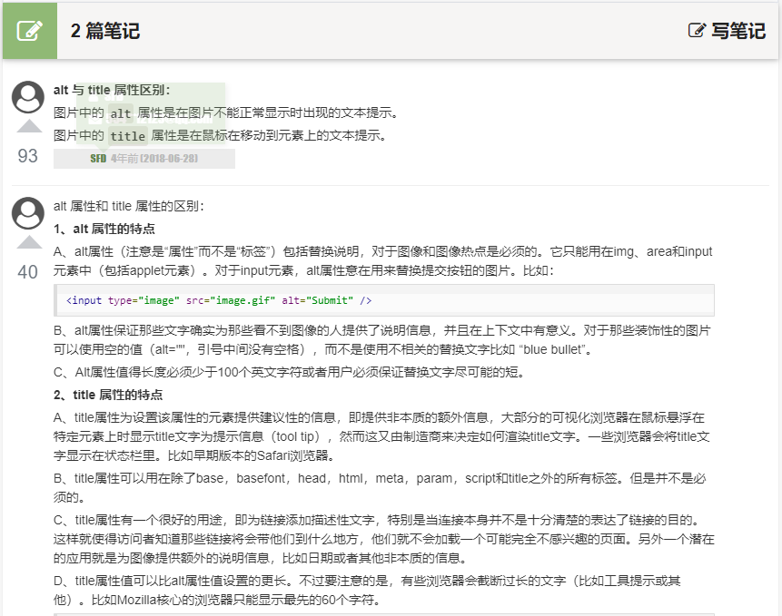

## 图像标签与路径
### 图像标签
|  属性   |             属性值             |                说明                |
| :-----: | :----------------------------: | :--------------------------------: |
|   src   |            图片路径            |              必须属性              |
|   alt   |              文本              |   替换文本，当图像不能正常显示时   |
|  title  |              文本              | 提示文本，鼠标放到图像上显示的文字 |
|  width  |              像素              |           设置图像的宽度           |
| height  |              像素              |           设置图像的高度           |
| border  |              像素              |         设置图像的边框粗细         |
| loading | eager：立即加载/lazy：延迟加载 |    指定浏览器是应立即加载图像还    |

注意：宽度和高度只给一个就行了，这样图片能等比例缩放，不然图片会被拉扯  
      这里面的border属性，一般不在img里面设定而是在css里设置  

属性之间不分顺序，属性采用键值对形式。
### 路径
相对路径：以引用文件所在位置为参考，而建立出的目录路径  
| 相对路径分类 | 符号  |               说明                |
| :----------: | :---: | :-------------------------------: |
|   同一路径   |       |      \      |
|   下一路径   |   /   |    \ |
|   上一路径   |  ../  | \ |  

绝对路径
