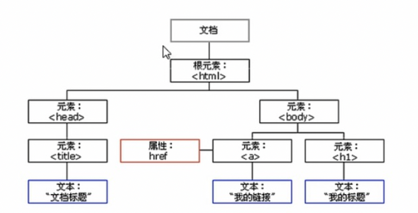
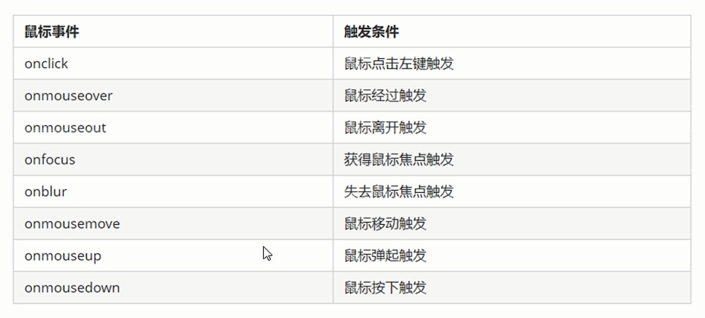

# DOM
* 什么是DOM
* 获取页面元素方式
* 给页面元素注册事件
* 能够操作DOM元素的属性
* 创建元素
* 操作DOM节点
# DOM简介

## DOM树🌲


+ 文档：一个页面就是一个文档，DOM中使用document表示
+ 元素：页面中的所有标签都是元素，DOM中使用element表示
+ 节点：网页中的所有内容都是节点（标签、 属性、文本、注释等），DOM中使用node表示
# DOM
文档对象模型(Document Object Model，简称 DOM），是W3C 组织推荐的处理可扩展标记语言（ HTML或者XML）的标准编程接口。W3C 已经定义了一系列的DOM 接口，通过这些DOM接口可以改变网页的内容、结构和样式。
# 获取元素
获取页面中的元素可以使用以下几种方式：
+ 根据`ID`获取
+ 根据标签名获取
+ 通过HTML5新增的方法获取
+ 特殊元素获取
## ID
```javascript
<div id = 'time'>123456</div>
    var timer = document.getElementById('time');
    console.log(timer); // <div id='time'>123456</div>
    console.log(typeof timer); // object 
    console.dir(timer); // div#time 下面一大串内容 dir表示获取其成员
```
* 参数id是大小写敏感的，且加‘’
* 因为文档页面从上往下加载，所以先得有标签script才能识别到ID，所以script写到标签的下面
* 返回一个匹配到ID的DOMElement对象，没有则返回null

## Tag
* 使用getElementsByTagName()返回带有固定指定标签名的

```javascript
  <ul>
    <li>test this paragraphy</li>
  </ul>
  <script>
    var lis = document.getElementsByTagName('li');
    console.log(lis);
    console.log(lis[0]);
    //打印里面的元素对象，采用遍历的形式
    for (var i = 0; i < lis.length; i++){
        console.log(lis[i]);
    }
  </script>
```
* 以伪数组的形式存储返回的值，是包含很多元素的对象
* 存储的内容是动态的，随着上面`li`里的内容改变而改变
* 如果只有一个li，返回的还是伪数组的形式
* 如果页面中没有这个元素返回的是**空的伪数组，不是null**

## 根据标签名获取
获取某个元素（父元素）内部所有指定标签名的子元素<br>
`element.getElementsByTagName('标签名');`
```javascript
<ol>
    <li>test this paragraphy</li>
  </ol>
  <script>
  var ol = document.getElementsByTagName('ol'); //[ol]
  console.log(ol[0].getElementsByTagName('li'));
  // 因为ol是个对象，不能直接使用必须指定父元素（ol）内部的具体对象
  //console.log(ol.getElementsByTagName('li')); 会报错
 </script>
```
注意：父元素必须是单个对象（必须指明是哪一个元素对象），获取的时候不包括父元素自己

如果嫌麻烦，可以采用 `getelementById` 的方式获取变量。
## ByClassName
```javascript
var box = document.getElementsByClassName('box');
```
## querySelector
返回指定选择器的<u>第一个元素对象</U>，注意：括号里的选择器需要加符号 .box #nav<br>
```javascript
var firstBox = document.querySelector('.box');
var nav = document.querySelector('#nav');
var li = document.querySelector('li');
```
## querySelectorAll
querySelectorA11()返回指定选择器的所有元素对象集合
```javascript
var lis = document.querySelectorAll('li');
```
## doucumnet.body
返回body元素对象
## document.documentElement
返回html元素对象
# 事件基础
事件：触发相应的一种机制<br>
网页中的每个元素都可以产生触发Javascript的事件，例如点击一个按钮，弹出对话框<br>
事件是有三部分组成或者事件三要素
* 事件源
* 事件类型 
* 事件处理程序
```javascript
  <button id='btn'>push</button>
  //1. 事件源 事件被触发的对象 谁 按钮
  <script>
  var btn = document.getElementById('btn');
  //2. 事件类型 如何触发 什么事件 比如鼠标点击(onclick）还是鼠标经过 还是键盘按下
  // 3. 事件处理程序 通过一个函数赋值的方式 完成
  btn.onclick = function() {
  alert(•点秋香”);
  }
  </script>
```
## 事件执行步骤
1. 获取事件源
2. 注册事件（绑定事件）
3. 添加事件处理程序
## 常见鼠标事件

# 操作元素
JS的DOM操作可以改变网页的内容、结构和样式，利用DOM操作元素来改变元素里的内容、属性等。
## 改变元素内容
```javascript
  element.innerText
```
从起始位置到终止位置的内容，但它去除html的标签，同时将空格和换行也去掉

```javascript
  element.innerHTML
```
从起始位置到终止位置的内容，包括html的标签，但<u>保留了空格和换行</u>

```javascript
  <button>显示当前系统时间</button>
  <div>某个时间</div>
  document.querySelector('button').onclick = function() {
      document.querySelector('div').innerText = getDate();
  }
  function getDate() {
    var date = new Date();
    var year = date.getFullYear(); // 返回当前日期的年
    var month = date.getMonth() + 1; // 返回月份 月份要➕1⃣️，因为默认month范围为（0，11）
    var dates = date.getDate(); // 返回几号
    var day = date.getDay(); // :0⃣️是周日 6⃣️是周六 3是周三
  // 解决日期问题，用数组
  
   var week = ['星期日','星期一','星期二','星期三','星期四','星期五','星期六'];
   return '今天是' + year + month + '月' + dates + '日' + week[day];
  }
```
## 常用元素的属性操作
1. scr href
2. id alt title
```javascript
    <button id='1'>1</button>
    <button id='2'>2</button>
    

    <script>
      var a1 = document.getElementById('1');
      var a2 = document.getElementById('2');
      var img = document.querySelector('img');

      a1.onclick = function() {
        img.src = '../Pics/mouse-events.png';
        img.alt = '2';
      }
      a2.onclick = function() {
        img.src = '../Pics/mouse-events.png';
        img.alt = '1';
      }
    </script>
```
## innerText vs innerHTML
1. innerText 不识别html标签 非标准 会去除空格和换行

2. innerHTML 识别html标签 W3C标准 保留空格和换行的

3. 这两个属性是可读写的 可以获取元素里面的内容

```javascript
<div></div>
<p>
    words
    <span>123</span>
</P>
<script>
    var div = document.querySelector('div');
    // innerText 去掉标签和空格
    div.innerText = '<strong>今天是：</strong> 2019';
    // innerHTML 保留标签、空格和换行
    div.innerHTML ='<strong>今天是：</strong> 2019’；
    var div = document.querySelector ('div');
    var p = document.querySelector('p');
   // 这两个属性是可读可写的，可以获取元素里的内容
    console.log(p.innerText);
    console.log(p.innerHTML);
</script>
```

   


# 节点操作